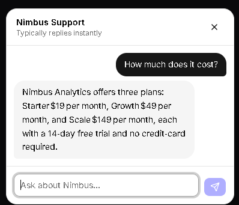

# SupportAI

Drop-in AI support widget that answers from your own FAQs and hands off to a human when unsure.

[Demo](https://support-ai-three-gold.vercel.app) · [Case study](https://support-ai-three-gold.vercel.app/case-study) · [Build log](./docs/build-log.md)



## What it does

- Floating chat widget with streaming answers
- RAG over your own FAQs (Supabase pgvector, Gemini embeddings)
- Hands off to a human when the model has no answer (tool-call signal, not threshold)
- Admin dashboard for FAQ CRUD and conversation review

## Stack

| Layer | Tech | Why |
|---|---|---|
| Frontend | Next.js 15 App Router, Tailwind v4, shadcn/ui | Server components, streaming-friendly |
| LLM | Groq gpt-oss-120b (primary), Gemini 3.1-flash-lite (fallback) | Sub-second latency, provider failover |
| Embeddings | Gemini gemini-embedding-001, 768-dim | Free tier, aligns with vector(768) |
| Vector store | Supabase Postgres + pgvector | Free tier, RLS, auth-ready |
| Streaming | Vercel AI SDK 7 | useChat + data parts |
| Email | Resend | Handoff notifications |
| Deploy | Vercel Hobby | Zero-config Next.js |

## Architecture

```text
Visitor → Chat widget → /api/chat → embed query → match_faqs (pgvector)
  → build prompt → Groq (fallback: Gemini) → stream → persist
  → no-answer tool: count → 2nd failure: handoff
```

## Running locally

```text
git clone <repo>
cd support-ai
npm install
cp .env.example .env.local
```

Fill in keys — table below

```text
npm run seed # populates 10 demo FAQs
npm run dev
```

## Environment variables

| Var | Where to get it |
|---|---|
| NEXT_PUBLIC_SUPABASE_URL | Supabase Project Settings → API |
| NEXT_PUBLIC_SUPABASE_ANON_KEY | same |
| SUPABASE_SERVICE_ROLE_KEY | same (secret — server only) |
| GOOGLE_GENERATIVE_AI_API_KEY | aistudio.google.com/apikey |
| GROQ_API_KEY | console.groq.com/keys |
| RESEND_API_KEY | resend.com/api-keys |
| SUPPORT_EMAIL | your destination inbox |
| ADMIN_PASSWORD | any string — gates /admin |
| APP_URL | deployed URL (or http://localhost:3000) |

## Database setup

Run the SQL from `docs/schema.sql` in the Supabase SQL editor. It creates
the extension, 4 tables, the `match_faqs` function, and the public read
policy on `faqs`.

## Deployment

Vercel, connect GitHub, set the 9 env vars, done.

## Project status

In v1: widget, RAG chat, tool-call handoff, admin dashboard, landing page,
case study.

Deliberately out: rate limiting, mid-stream provider fallback, multi-user
admin, stop button on streaming. Reasoning in the
[case study](/case-study).

## License

MIT.

Built by Darvin Raj — [GitHub](https://github.com/darvinraj400-ux).
Nimbus Analytics is a fictional product created for this case study.
